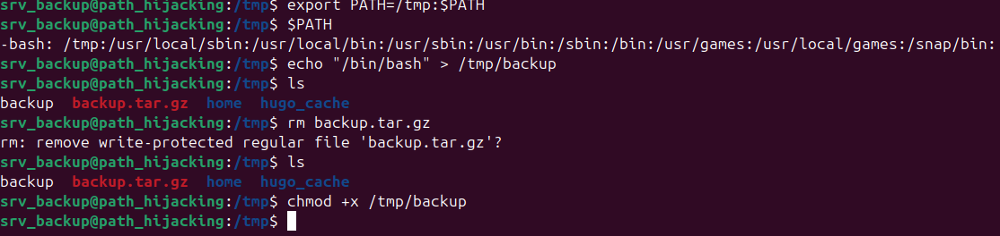

# 🐳 Whoami Labs: [Path Hijacking]

| Propiedad | Detalle |
| :--- | :--- |
| **Plataforma** | Whoami Labs |
| **Dificultad** | 🟢 Fácil  |
| **OS** | Linux  |
| **IP de la Máquina** | `172.0.0.2` |
| **Fecha de resolución** | 2026-09-02 |

---

## 📝 Descripción
SUID & Sudo
Máquina enfocada en la explotación de un servicio web vulnerable y posterior escalada de privilegios mediante abuso de permisos SUDO.

---

## 🔍 1. Fase de Reconocimiento y Enumeración

### Escaneo de Puertos (`nmap`)
Lanzamos un escaneo inicial para identificar los puertos abiertos y los servicios activos en la máquina objetivo:

```bash
sudo nmap -p- --open -sS --min-rate 5000 -vvv -n -Pn 172.17.0.2 -oN allPorts
```

**Resultados del escaneo:**
* **Puerto 22/TCP**: SSH
* **Puerto 80/TCP**: HTTP
* **Puerto 8080/TCP**: HTTP:PROXY

*Escaneo profundo de servicios:*
```bash
sudo nmap -p22,80,8080 -sCV 172.17.0.2 -oN targeted
```
| Puerto | Estado | Servicio | Versión |
| :---: | :---: | :--- | :--- |
| **22 / TCP** | 🟢 Abierto | SSH | OpenSSH 8.9p1 (Ubuntu Linux) |
| **80 / TCP** | 🟢 Abierto | HTTP | SimpleHTTPServer 0.6 (Python 3.10.12) |
| **8080 / TCP** | 🟢 Abierto | HTTP | Golang net/http server |

Vemos que tenemos dos sitios web y el puerto ssh pero no conocemos ninguna credencial así que empezamos revisando los sitios web.

### Enumeración Web (Puerto 80)
Al inspeccionar el sitio web, nos encontramos con la siguiente interfaz:


Aplicamos fuzzing de directorios usando dirbuster para buscar rutas ocultas:


---

### Enumeración Web (Puerto 8080)
Al inspeccionar el sitio web, nos encontramos con la siguiente interfaz:


Aplicamos fuzzing de directorios pero no encontramos nada, por lo que de momento la descartamos y continuamos con la web del puerto 80.


## 💥 2. Fase de Explotación 

### Vector de Ataque
En la enumeración web, descubrimos un directorio dev con dos carpetas y un txt. Después de ir revisando todos los documentos que contenía, descubrimos que dentro de un fichero en python dentro del directorio .conf hay unas credenciales de un usuario de ssh.
Probamos las credenciales encontradas para conectarnos por ssh al puerto 22 y funcionan.
Ahora somos el usuario srv_backup.


---

## 👑 3. Escalada de Privilegios

### Enumeración del Sistema
Analizamos el entorno buscando vectores comunes de escalada (permisos SUID, tareas Cron, capacidades, contraseñas en texto plano).

```bash
# Comprobamos privilegios de SUDO
sudo -l
```




### Explotación del Vector de Escalada
Encontrado un binario o configuración débil. Explicar cómo se abusa de ello para convertirse en `root`.

```bash
# Ejemplo de explotación
sudo /usr/bin/env /bin/sh
```


¡Ya somos **root**! 🚩

---

## 🏁 4. Conclusiones y Mitigación
* **Vulnerabilidad Principal**: Falta de sanitización en los parámetros web de entrada / Binarios con permisos SUDO mal configurados.
* **Remediación**: Actualizar los servicios vulnerables, implementar *whitelisting* en los inputs y aplicar el principio de menor privilegio retirando accesos SUDO innecesarios.

